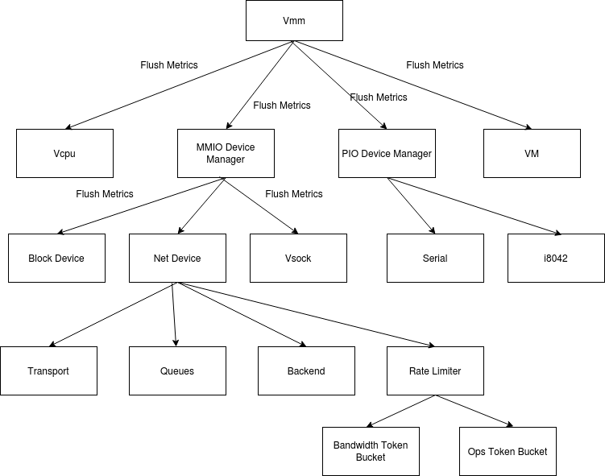

# Component Defined Metrics

## Scope

This document proposes a new design for the metric system that enables metrics
to be defined by individual components. The purpose of this separation comes in
the context of rust-vmm components where there is a strong need to have metrics
as an optional feature. As multiple stakeholders are using these components,
there are also questions regarding the serialization format, as metrics are
expected to be flexible enough to allow different formatting, serialization and
writers. When using the rust-vmm metrics, the expectation is that VMMs built on
top of these components can choose what metrics they’re interested in and also
can add their own custom metrics without the need to maintain forks.

## Goals

### Separate the metric definition from system-wide metric configuration

In a component defined metric system, the component has knowledge about what
metrics are needed for successful ops. In other words, the component will
define its own metrics.

While the component is aware of the required metrics, it should not be aware
about things such as serialization format, writers and other system
configurations as these should be defined at a higher abstraction level and
should be the same for all the metrics that can be defined for the system.

Let’s assume a basic VMM with 3 components: a block device, a linux loader and
serial console implementation. Each of these components will define their own
metric. As these metric will be at some point collected by the Vmm, the Vmm
should define the same formatter, serialization and write destination for all
of them.

### Hierarchical metric system

A typical, complex application usually has several levels of abstractions. We
can consider the central object of rust-vmm based VMM to be the Vmm object.
When the Vmm gets a request to flush its metrics, it will write the metrics
that are specific to the Vmm and then ask its components to flush their
metrics. The same happens for all the components of the Vmm.

The image bellow represents how the flush metric action travels from the Vmm to
all its transitive dependencies. Each arrow represents a flush request. Each
component flushes its own metrics and then asks all of its dependencies to do
the same.



### Allow all metrics of one component to be disabled

Disabling all metrics for one component should be a zero cost abstraction. When
users are not interested in flushing metrics, they should be allowed to simply
bypass them.

### Only initialized components have metrics

In a hierarchical metric system this property is a given as metrics are
initialized only when the component is initialized.

### Unit tests depending on metrics can be run in parallel

With non-global metrics, unit tests can initialize the component based metrics
when starting the test. This implies that all tests are run with zeroed metrics
and are independent of other tests.

### Metric Interface and Example

The metric crate offers traits and implementations for implementing custom metrics.

```rust
pub trait Metric {
    /// Adds `value` to the current counter.
    fn add(&self, value: usize);
    /// Increments by 1 unit the current counter.
    fn inc(&self);
    /// Returns current value of the counter.
    fn count(&self) -> usize;
    /// Resets the metric count
    // This is optional, it can also live in the implementation and not the trait.
    fn reset(&self);
}

pub trait MetricWriter {
    fn write(&self, buffer: &mut (dyn Write + Send));
}
```

For ease of use, the metric crate implements the `Metric` trait for
`AtomicUsize` and for a specialized metric type called `MetricDiff` (the
equivalent of `SharedMetric` in Firecracker). Additionally, `Serialize` is
implemented for `DiffMetric` (TODO we might want to delete this because
otherwise we need to use the `NewType Pattern` in order to override the write
format of the metrics).

To give users the possibility to disable certain metrics within one component,
both `Metric` and `MetricWriter` are implemented for `()` - the empty type.

For the sake of the example, let’s say we have a dummy block device with only
two operations that can generate metrics: `activate` and `set_features`.

The block device will define its own trait for metrics that can be implemented
by its caller.

```rust
pub trait BlockMetrics : MetricWriter {
    fn feature_error_inc(&self) {}
    fn activate_error_inc(&self) {}
    fn successful_activation_inc(&self) {}
}
```

As we want the metrics to be optional, the block device comes with a no-op
implementation for its metrics:

`impl BlockMetrics for () { }`

To allow the caller of BlockDevice to specify the metrics implementation,
the BlockDevice uses generics as follows:

```rust
pub struct BlockDevice<T: BlockMetrics> {
    metrics: T,
    ...
}
```

The BlockDevice can be initialized as follows:

```rust
// Block Device without metrics;
let block_device = BlockDevice::new();

// Block Device with metrics, where FcBlockMetrics can be defined by the
// caller or passed by a parent as a parameter.
let block_device = BlockDevice::<FcBlockMetrics>::new();
```

When the BlockDevice wants to increment the feature error metric, it calls
`feature_error_inc`. When the block device was not initialized with metrics,
calling `feature_error_inc()` is a no op that most likely will be compiled out.

For a full example, please check the code.

## Disadvantages of this proposal

### LOC

The main disadvantage of this proposal when compared to the current Firecracker
metric implementation is that more code is required for achieving the same
result.

With the current metric implementation, for our dummy block device we would
just need a struct as follows:

```rust
struct BlockMetrics {
    feature_error: DiffMetric,
    activate_error: DiffMetric,
    successful_activation: DiffMetric,
}
```

With the proposal in this document, the block device defines a trait for its
metrics and the Vmm/Builder must define a struct and implement the trait for
it as follows:

```rust
#[derive(Default, Serialize)]
pub struct FcBlockMetrics {
    successful_activation: DiffMetric,
    activate_error: DiffMetric,
    features_error: DiffMetric,
}

impl BlockMetrics for FcBlockMetrics {
    .....
}
```

